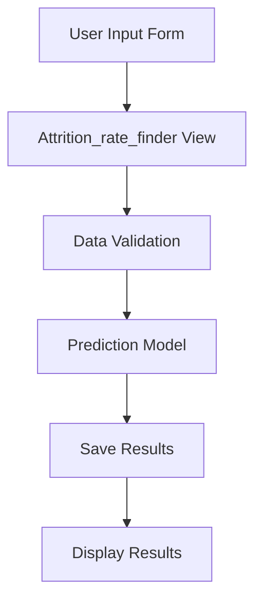
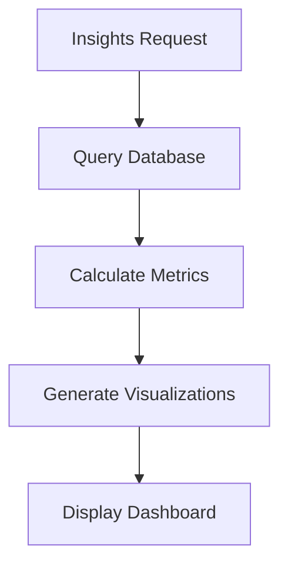

# Code Flow and Analysis Guide

This document provides a detailed explanation of how the Attrition Predictor application works, including code flow and analysis methodology.

## Table of Contents
1. [Application Architecture](#application-architecture)
2. [Code Flow](#code-flow)
3. [Analysis Process](#analysis-process)
4. [Data Processing](#data-processing)
5. [Machine Learning Model](#machine-learning-model)
6. [Insights Generation](#insights-generation)

## Application Architecture

The application follows a Django MVT (Model-View-Template) architecture:

```
attrition-predictor/
├── apps/
│   ├── models.py         # Data models
│   ├── views.py          # Business logic
│   └── urls.py           # URL routing
├── templates/            # HTML templates
└── static/              # Static assets
```

## Code Flow

### 1. User Input Flow


1. **Form Submission**
   - User submits data through `attrition_form.html`
   - Data includes: name, location, department, age, experience, etc.

2. **Data Processing**
   - `Attrition_rate_finder` view processes form data
   - Converts string inputs to appropriate data types
   - Validates numeric fields (age, experience)

3. **Prediction**
   - `Finder` function processes input data
   - Applies necessary transformations
   - Uses loaded ML model to make prediction

4. **Result Storage**
   - Creates `AttritionPrediction` object
   - Stores prediction results in database
   - Includes timestamp and all input parameters

### 2. Insights Generation Flow



1. **Data Aggregation**
   - Queries `AttritionPrediction` model
   - Calculates total predictions and risk counts
   - Groups data by department and age ranges

2. **Metrics Calculation**
   - Computes risk percentages
   - Analyzes departmental trends
   - Generates age-based statistics

## Analysis Process

### 1. Risk Assessment
The application uses multiple factors to assess attrition risk:

- **Demographic Factors**
  - Age
  - Gender
  - Marital Status

- **Professional Factors**
  - Experience
  - Department
  - Job Role Match
  - Promotion History

- **Organizational Factors**
  - Employee Group
  - Tenure
  - Location

### 2. Risk Calculation

The risk score is calculated based on:
1. Individual factor weights
2. Historical patterns
3. Department-specific trends

## Data Processing

### 1. Input Transformations

```python
# Example transformations
def process_input(data):
    # Age grouping
    if age < 25: return '<25'
    elif age < 35: return '25-35'
    elif age < 45: return '35-45'
    else: return '45+'

    # Experience normalization
    experience = float(experience) if experience else 0
```

### 2. Data Validation
- Numeric field validation
- Required field checking
- Data type conversion
- Range validation

## Machine Learning Model

### 1. Model Architecture
- Uses Random Forest Classifier
- Features engineered from input parameters
- Binary classification (At Risk/Not At Risk)

### 2. Prediction Process
```python
def make_prediction(data):
    # 1. Preprocess data
    processed_data = preprocess(data)
    
    # 2. Generate features
    features = generate_features(processed_data)
    
    # 3. Make prediction
    prediction = model.predict(features)
    
    # 4. Calculate confidence score
    confidence = model.predict_proba(features)
```

## Insights Generation

### 1. Overview Metrics
- Total predictions count
- High-risk percentage
- Low-risk percentage

### 2. Department Analysis
```python
department_analysis = (
    AttritionPrediction.objects
    .values('function')
    .annotate(
        total=Count('id'),
        at_risk=Count('id', filter=Q(prediction_result=True))
    )
    .order_by('function')
)
```

### 3. Age Group Analysis
- Groups employees into age brackets
- Calculates risk percentages per group
- Identifies high-risk age ranges

### 4. Monthly Trends
```python
monthly_predictions = (
    AttritionPrediction.objects
    .annotate(month=TruncMonth('prediction_date'))
    .values('month')
    .annotate(
        total=Count('id'),
        at_risk=Count('id', filter=Q(prediction_result=True))
    )
    .order_by('month')
)
```

## Best Practices

1. **Code Organization**
   - Separate business logic from views
   - Use Django's ORM for database operations
   - Implement proper error handling

2. **Performance Optimization**
   - Use database indexes
   - Implement caching where appropriate
   - Optimize database queries

3. **Security Considerations**
   - Input validation
   - CSRF protection
   - Secure data storage

## Maintenance and Updates

1. **Model Updates**
   - Regular model retraining
   - Performance monitoring
   - Feature importance analysis

2. **Database Maintenance**
   - Regular backups
   - Data cleanup
   - Index optimization

3. **Code Updates**
   - Version control
   - Documentation updates
   - Dependency management
